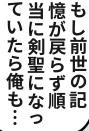
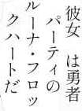
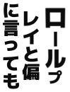
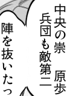
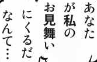
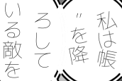
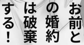
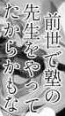
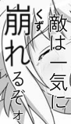

# JMangaBench_Syn

5,000 synthetic Japanese manga text crops for OCR evaluation.  
用于 OCR 评测的 5,000 张日语漫画合成文字图片。

[English](#english) · [中文](#中文) · [Results](#results-en) · [结果](#results-zh)

<a id="english"></a>

## English

### Examples

Three examples per subset, spanning balloons and text over artwork. These illustrate appearance, not average OCR difficulty. Images are original benchmark files.

| real | realscan | enhanced |
|---|---|---|
|  |  |  |
|  |  |  |
|  |  |  |


JMangaBench_Syn is a synthetic extension of [JMangaBench-Mixed](https://github.com/muscgab/JMangaBench_Mixed), designed to strengthen evaluation against data contamination. It reduces reliance on real manga images that may already appear in OCR training data. Synthetic images reduce this risk but do not guarantee that the source text or visual assets are unseen by a model.

| Subset | Images | Description |
|---|---:|---|
| `real` | 2,000 | Manga-style text crops |
| `realscan` | 2,000 | Scan-style text crops |
| `enhanced` | 1,000 | Text crops with additional visual and layout challenges |
| **Total** | **5,000** | **All images are synthetic** |

### Distribution coverage

Images are produced against predefined bucket targets for manga-like data distributions and checked after rendering. The maximum absolute relative count deviation, `|actual − target| / target`, is **12.92%** among applicable buckets across the full set and subsets. Applicability follows the original audit threshold of at least 200 expected samples.

Including small buckets, the maximum is **40.22% for the full 5,000-image set**, or **100% when examining all subset buckets** (about 5 images expected, 0 observed). These figures describe agreement with the target distribution, not visual realism or coverage of every real manga style.

### Text and labels

The text corpus comes from the maintainer's private manga collection, MangaOCR pseudo-labeling, and Terra/Luna cleaning. Each reference contains the rendered body text; furigana (ruby) is excluded.

The code package does not include the original manga or the full source corpus. All 5,000 images and evaluation annotations are publicly available in [GitHub Releases](https://github.com/muscgab/JMangaBench_Syn/releases/tag/data-v1). No account or token is required. This package grants no additional rights to redistribute source assets.

### Evaluation

This version uses **V2.2 normalization** on both references and predictions. EM is the fraction of exact matches. CER is total character edit distance divided by total reference characters. Both are reported for each subset and the full set. Raw-text and body-only scores are also included.

Ellipsis runs collapse to one `…`; repeated long-vowel marks and wave marks collapse to one `ー` and `〜`, respectively. One or two ordinary dots retain their distinction. Hiragana/katakana pairs such as `へ/ヘ` remain distinct, as do long-vowel marks, dashes, minus signs and hyphens.

See the [normalization specification](NORMALIZATION_V2_2.md) and the [results table](#results-en). Scores from different normalization versions are not directly comparable.

### Usage

Use the commands in [Quick start](#quick-start-en). Supply one JSONL prediction per image ID. Keep failed predictions with an error description. The evaluator checks missing, duplicate and invalid records rather than silently dropping them.

### Limitations

`realscan` (manga_scan) simulates non-handwritten, non-artistic lettering in scanned manga. It does not represent a model's full capabilities on real manga.

`enhanced` is substantially farther from the real manga distribution. It serves only as a reference for the limits of generalization under additional perturbations, not as a formal upper bound or a measure of overall real-world performance.


Synthetic text does not cover all handwriting or extreme artistic lettering in real manga. This benchmark complements evaluation on real images. Some images share source text or related visual variants, so they should not be treated as fully independent observations.

<a id="results-en"></a>

### Results

**V2.2 normalized EM / CER. Higher EM and lower CER are better.**

| Model | real EM / CER | realscan EM / CER | enhanced EM / CER | Overall EM / CER |
|---|---:|---:|---:|---:|
| MangaOCR | 89.60% / 1.5779% | 88.80% / 1.9209% | 72.80% / 4.4524% | 85.92% / 2.2853% |
| BaberuOCR | 87.80% / 1.7116% | 86.15% / 2.0124% | 72.70% / 4.3912% | 84.12% / 2.3635% |
| HayaiOCR v2.1 | 89.05% / 1.6555% | 89.10% / 2.0995% | 72.90% / 4.4349% | 85.84% / 2.3843% |
| PaddleOCR-VL-For-Manga | 91.45% / 1.2373% | 89.35% / 1.5332% | 75.50% / 3.9363% | 87.42% / 1.8911% |

All four models completed 5,000 images with zero inference errors. Inference used an RTX 4070 12GB; batch sizes were 32 / 64 / 64 / 8 in table order. These results are not a latency benchmark.

Paddle results include a [batch attention correction](adapters/paddle_sdpa_boundary_fix.patch), verified by a [batch consistency check](adapters/paddle_sdpa_boundary_fix_repro.json). Weights, prompts and decoding settings were unchanged.

<a id="quick-start-en"></a>

### Quick start

Download and verify the public data using Python 3.9 or newer (standard library only).

```bash
python3 download_benchmark.py --output /path/to/JmangaBench_Syn

python3 -m pip install -r evaluation/requirements.txt
python3 evaluation/evaluate.py \
  --manifest /path/to/JmangaBench_Syn/manifest.jsonl \
  --predictions /path/to/predictions.jsonl \
  --output /path/to/report.json
```

Submit one prediction per image:

```json
{"id":"<image ID>","prediction":"モデルの出力","error":null}
```

On success, `error` may be omitted, `null`, or an empty string.

---

<a id="中文"></a>

## 中文

### 样例

每类展示三张，涵盖气泡文字与背景上的文字。这些样例用于展示外观，不代表平均识别难度；图片直接取自评测集。

| real | realscan | enhanced |
|---|---|---|
|  |  |  |
|  |  |  |
|  |  |  |


JMangaBench_Syn 是 [JMangaBench-Mixed](https://github.com/muscgab/JMangaBench_Mixed) 的合成数据加强版，旨在增强评测对数据污染的抵抗力：减少对可能已进入 OCR 训练集的真实漫画图片的依赖。合成图片可以降低这类风险，但不能保证模型从未接触其文本来源或视觉资产。

| 子集 | 图片数 | 说明 |
|---|---:|---|
| `real` | 2,000 | 普通漫画风格文字图片 |
| `realscan` | 2,000 | 扫描漫画风格文字图片 |
| `enhanced` | 1,000 | 增加视觉与排版难度的文字图片 |
| **合计** | **5,000** | **全部为合成图片** |

### 分布覆盖

图片以漫画风格数据分布的预设桶配额为基准生产，渲染后再核对实际分布。按 `|实际数量 − 目标数量| / 目标数量` 计算，全量及各子集中适用验收桶的最大绝对相对偏差为 **12.92%**；适用范围沿用原审计中预期至少 200 张的门槛。

如果纳入小样本桶，**全量 5,000 张的最大偏差为 40.22%**；进一步检查各子集的全部桶，最大为 **100%**（预期约 5 张、实际 0 张）。这些数字只说明与目标分布的接近程度，不代表视觉真实性，也不表示覆盖了所有真实漫画风格。

### 文本与标签

文本语料来自维护者的私有漫画、MangaOCR 伪标注，以及 Terra/Luna 清洗。每张图片的参考答案为实际绘制的正文，不包含注音（ruby）。

代码包不包含原始漫画或完整源语料。全部 5,000 张图片和评测标注已在 [GitHub Releases](https://github.com/muscgab/JMangaBench_Syn/releases/tag/data-v1) 公开，无需账号或 token。本项目不额外授予源资产的再分发权利。

### 评测

本版本对参考答案与预测统一使用 **V2.2 归一化**。EM 为完全匹配的样本比例；CER 为字符编辑距离总和除以参考字符总数。分别报告三个子集与全量结果，同时保留原始文本和纯正文指标。

连续省略号统一为一个 `…`，连续长音和波浪线分别统一为一个 `ー` 和 `〜`。一两个普通点保留原有区别。`へ/ヘ` 等平假名与片假名保持区分；长音、破折号、减号和连字符也分别处理。

详见[归一化规范](NORMALIZATION_V2_2.md)和下方的[结果表](#results-zh)。不同归一化版本的分数不能直接比较。

### 使用

按照[快速开始](#quick-start-zh)中的命令操作，每个图片 ID 提交一条 JSONL 预测。失败样本需保留并填写错误说明。评测器会检查缺失、重复和非法记录，不会静默丢弃这些样本。

### 局限

`realscan`（manga_scan）模拟真实扫描漫画中的非手写、非艺术字文本，不能代表模型在真实漫画上的全部能力。

`enhanced` 已较为脱离真实漫画分布，仅作为模型在额外扰动下泛化上限的参考，不是严格的能力上界，也不代表整体真实场景表现。


合成文字不能覆盖真实漫画中的所有手写体和极端艺术字，本评测集用于补充真实图片评测。部分图片共享文本来源或属于相关视觉变体，不应视为完全独立的样本。

<a id="results-zh"></a>

### 结果

**V2.2 归一化后的 EM / CER；EM 越高越好，CER 越低越好。**

| 模型 | real EM / CER | realscan EM / CER | enhanced EM / CER | 全量 EM / CER |
|---|---:|---:|---:|---:|
| MangaOCR | 89.60% / 1.5779% | 88.80% / 1.9209% | 72.80% / 4.4524% | 85.92% / 2.2853% |
| BaberuOCR | 87.80% / 1.7116% | 86.15% / 2.0124% | 72.70% / 4.3912% | 84.12% / 2.3635% |
| HayaiOCR v2.1 | 89.05% / 1.6555% | 89.10% / 2.0995% | 72.90% / 4.4349% | 85.84% / 2.3843% |
| PaddleOCR-VL-For-Manga | 91.45% / 1.2373% | 89.35% / 1.5332% | 75.50% / 3.9363% | 87.42% / 1.8911% |

四个模型均完成 5,000 张图片的推理，推理错误为零。使用 RTX 4070 12GB，batch 按表格顺序为 32 / 64 / 64 / 8。这些结果不作为延迟基准。

Paddle 结果包含[批处理注意力修复](adapters/paddle_sdpa_boundary_fix.patch)，并通过[批次一致性检查](adapters/paddle_sdpa_boundary_fix_repro.json)。权重、提示词和解码设置未改变。

<a id="quick-start-zh"></a>

### 快速开始

使用 Python 3.9 或更新版本下载并校验公开数据（下载器仅使用标准库）。

```bash
python3 download_benchmark.py --output /path/to/JmangaBench_Syn

python3 -m pip install -r evaluation/requirements.txt
python3 evaluation/evaluate.py \
  --manifest /path/to/JmangaBench_Syn/manifest.jsonl \
  --predictions /path/to/predictions.jsonl \
  --output /path/to/report.json
```

每张图片提交一条预测：

```json
{"id":"<image ID>","prediction":"モデルの出力","error":null}
```

成功时，`error` 可省略、设为 `null` 或空字符串。
